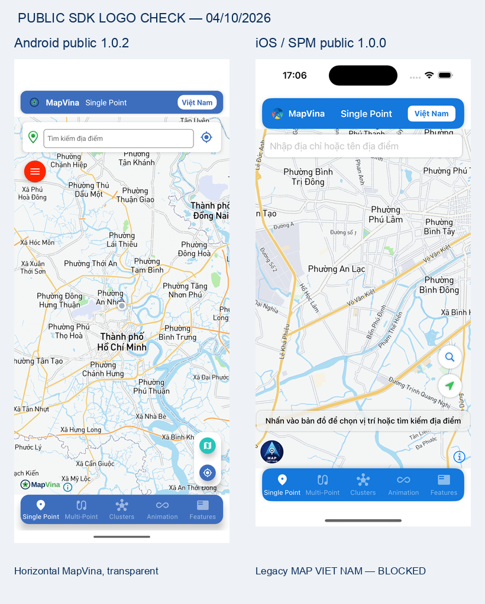

# Audit delivery — 04/10/2026

All 11 repositories use `codex/docs-verification-20261004`, created from their
recorded `origin/main` baselines. Pushed and PRs created by **Sunny0025-IT**.
PRs target `main`, are open and unmerged. No migration merge, SDK API/logic/version
change, tag, publish or force-push was performed.

The commit column records the **tested audit commit**. This delivery index and
resized comparison image are a documentation-only follow-up on the Android docs
branch; for the current branch head see the linked PR. All remaining source
checkouts keep their original audit commit.

| Repository | Audit commit | PR into main | Local audit result |
| --- | --- | --- | --- |
| mapvina-document-android | `9c4bd96` | [PR](https://github.com/mapvina/mapvina-document-android/pull/1) | PARTIAL PASS: demo/example build; streets/night/satellite and logo smoke PASS; demo unit NO-SOURCE; example one arithmetic test; snapshot/device tests NOT TESTED |
| mapvina-document-ios | `20a610f` | [PR](https://github.com/mapvina/mapvina-document-ios/pull/1) | BUILD/RUNTIME PASS with public SPM 1.0.0; NEW BRANDING BLOCKED; navigation/landscape/snapshot NOT TESTED |
| mapvina-document-flutter | `cb7871c` | [PR](https://github.com/mapvina/mapvina-document-flutter/pull/1) | PUB RESOLVE PASS for hosted 1.0.1; ANDROID/iOS BUILD BLOCKED; API key/logo/runtime NOT TESTED |
| mapvina-document-reactnative | `d22be3b` | [PR](https://github.com/mapvina/mapvina-document-reactnative/pull/1) | PUBLIC npm 1.0.2 INSTALL PASS; RN CLI/Expo Android compile BLOCKED; iOS pod deployment BLOCKED; runtime NOT TESTED; manifests/locks not upgraded |
| mapvina-native | `031cd9c` | [PR](https://github.com/mapvina/mapvina-native/pull/8) | ANDROID six public 1.0.2 ARTIFACT CHECKS PASS; public iOS 1.0.0 branding/distribution BLOCKED; source/native matrix rebuild NOT TESTED |
| mapvina-gl-native-distribution | `80eb45e` | [PR](https://github.com/mapvina/mapvina-gl-native-distribution/pull/1) | PUBLIC SPM 1.0.0 MANIFEST/CHECKSUM PASS; public sample build/render PASS; NEW BRANDING BLOCKED; Playground/static/device NOT TESTED |
| flutter-mapvina-gl | `d2f7008` | [PR](https://github.com/mapvina/flutter-mapvina-gl/pull/34) | HOSTED 1.0.1 INTEGRATION BLOCKED in documentation sample; source package version 1.0.0 is recorded separately; wrapper source tests/runtime NOT TESTED |
| mapvina-react-native | `77e47a0` | [PR](https://github.com/mapvina/mapvina-react-native/pull/19) | PUBLIC npm 1.0.2 ANDROID INTEGRATION BLOCKED; main source version 1.0.1 recorded separately; source TS/native test suite/new-arch runtime NOT TESTED |
| mapvina-plugins-android | `ec7706e` | [PR](https://github.com/mapvina/mapvina-plugins-android/pull/1) | SOURCE ANNOTATION MODULE BUILD PASS with JDK17; public namespace compatibility with RN BLOCKED; other modules/test-app/runtime NOT TESTED |
| mapvina-navigation-android | `e097f68` | [PR](https://github.com/mapvina/mapvina-navigation-android/pull/12) | MAIN SOURCE BUILD BLOCKED by location-engine imports; navigation runtime NOT TESTED; original checkout unfinished rebase preserved |
| MapVina-Android-Auto-Sample | `66f7c69` | [PR](https://github.com/mapvina/MapVina-Android-Auto-Sample/pull/3) | PUBLIC DEPENDENCY BUILD BLOCKED by Kotlin 2.3 metadata vs 2.1 compiler; AAOS/head-unit/logo/navigation runtime NOT TESTED |

## Gates

- All 11 remote branch heads match the local/PR head at verification time.
- All new relative report links exist in the committed Git trees. Public GitHub
  report URLs are readable after push; changed GitHub URLs were checked by API.
- New Markdown, JSON and full base-to-head `git diff --check` pass. Android
  demo/example and public iOS sample final build gates pass; other reproduced
  failures are preserved with logs, not hidden or described as runtime PASS.
- GitHub CI status: **NOT VERIFIED**. The Codex checks connector requested
  ChatGPT/GitHub sign-in. No source-control CLI diagnostics fallback was used;
  this limitation does not mean CI passed, failed or did not run. Keep CI/review
  as a separate merge gate. No PR was auto-merged.
- Flutter wrapper generated example folders and Android Auto `.kotlin` error
  caches are untracked/excluded, not pushed. The original navigation checkout's
  unfinished rebase is preserved; its audit uses an isolated checkout.

## Runtime image comparison

The composite below only resizes the two full emulator/simulator screenshots.
Original PNGs and their detailed acceptance limits are linked in each report.
It does not replace binary/provenance evidence and does not certify snapshot,
accessibility contrast, every screen size or SDK-wrapper runtime.

## Recommendation

Review these scoped documentation/sample PRs independently of migration work.
Do not advertise all integrations as ready: public iOS branding/distribution,
Flutter builds, RN annotation namespace/pod lock state, navigation imports and
Android Auto Kotlin metadata remain tracked in five separate blocker issues.
Android navy logo contrast on dark/satellite is a visual advisory, not a tested
accessibility pass. Fix SDK/infra in separate PRs; rerun public-package integration
and update the dated documentation only after each failure is resolved.
