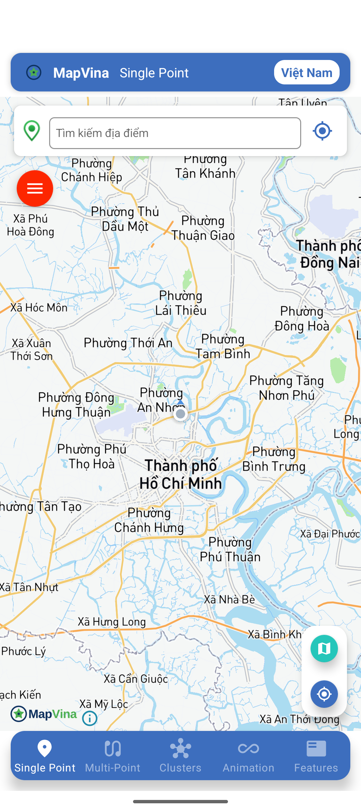
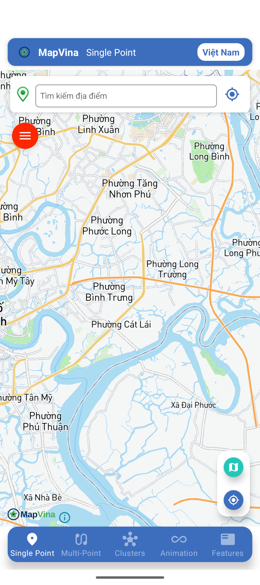
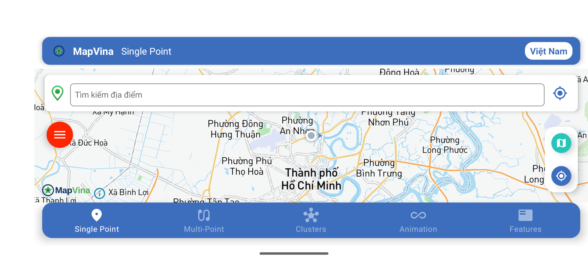
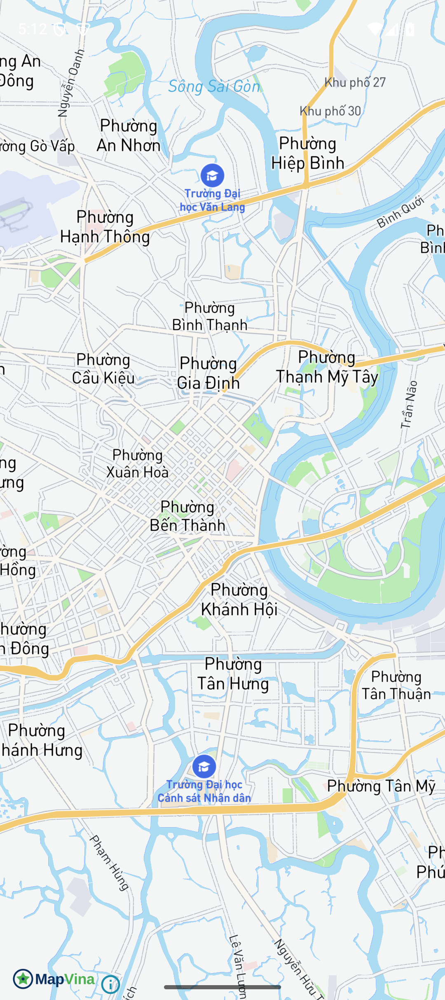
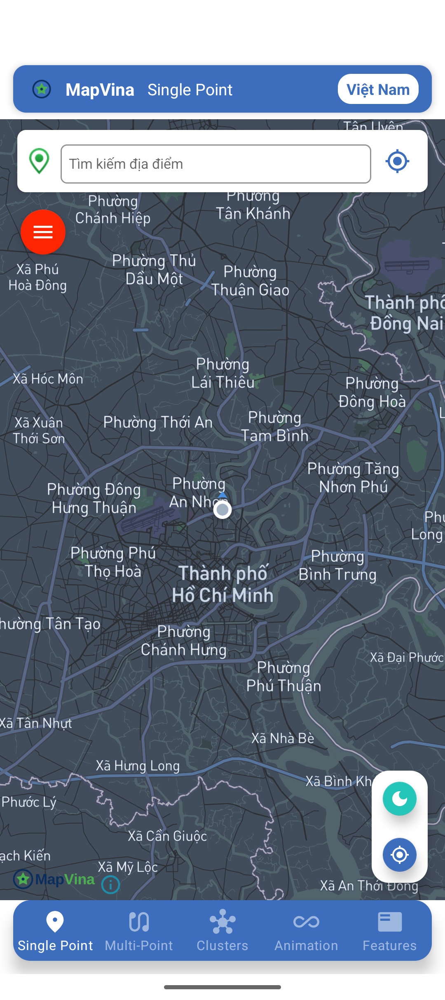
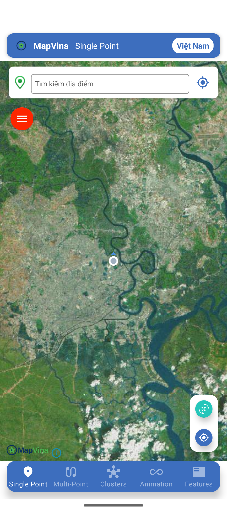

# mapvina-document-android: verification 04/10/2026

**Status: PARTIAL PASS.**

Core public `1.0.2`; GeoJSON/Turf/Gestures public `1.0.1`; annotation public `1.0.0`.

Source baseline: `dfa29ced47be1822e50836210cbca8b95cdea951` (`origin/main` plus the sample/doc changes in this PR).

Audit only: no SDK API/version changes, tags, publishing or main merge.

## Tích hợp Android đã kiểm chứng

`demo/` và `example/` dùng `google()` + `mavenCentral()`, không cần Maven local.
Chỉ chọn một core renderer. Cấu hình đang được kiểm chứng:

```groovy
implementation 'io.github.mapvina:android-sdk:1.0.2'
implementation 'io.github.mapvina:android-sdk-geojson:1.0.1'
implementation('io.github.mapvina:android-plugin-annotation-v9:1.0.0') {
    exclude group: 'io.github.mapvina', module: 'android-sdk-opengl'
}
```

Khởi tạo trước khi inflate `MapView`, như sample:

```kotlin
MapVina.getInstance(this, "public", WellKnownTileServer.MapVina)
```

Import từ `io.github.mapvina.android`; key `public` chỉ dành cho demo. Dùng key do
dịch vụ cấp trong ứng dụng thật và không commit key riêng. Style demo là streets
của MapVina; quyền vị trí chỉ cần cho tính năng vị trí, không phải để render map.

```bash
cd demo
./gradlew :app:assembleDebug :app:testDebugUnitTest --console=plain
cd ../example
./gradlew :app:assembleDebug :app:testDebugUnitTest --console=plain
```

Build của cả hai sample PASS. Demo unit task là **NO-SOURCE**, không có test
được chạy; example có một test `addition_isCorrect` PASS (lượt cuối UP-TO-DATE).
Không có unit/instrumentation test logo; branding được kiểm riêng bằng AAR và
ảnh emulator Pixel 9 API 35 tại TP.HCM.
`example` dùng Kotlin `2.2.10`; demo vẫn dùng toolchain hiện hữu trong Gradle.
Logo ngang bottom-start, nền trong suốt, giữ API SDK. Header demo dùng icon từ AAR.

| Case runtime | Kết quả |
| --- | --- |
| Streets portrait, tải tiles (demo + example) | PASS sau khi đặt GPS mock TP.HCM |
| Pan/zoom streets | PASS qua thao tác và ảnh trước/sau |
| Streets landscape (demo) | PASS trên emulator này; không suy ra mọi kích thước đều đạt |
| Dark/night portrait | PASS: tiles render tại TP.HCM, logo trong suốt bottom-start |
| Satellite/3D style portrait | PASS: raster satellite render tại TP.HCM; không nghiệm thu 3D buildings |
| Snapshot rộng/hẹp, disable logo, bốn vị trí ornament | NOT TESTED trong đợt này |
| Thiết bị thật, màn hình nhỏ, Android Auto | NOT TESTED |

Lượt đầu demo bị đưa tới GPS cache `39.237255,-123.150032` ngoài vùng dữ liệu,
map trống nhưng logo vẫn hiện. `adb emu geo fix` không cập nhật fused cache;
lượt kiểm lại dùng test providers `gps` và `fused` ở `10.8231,106.70098`.
Ảnh streets mới xác minh tile render thực tại TP.HCM, không dùng ảnh trống làm PASS.
Xem [lệnh GPS và runtime](evidence/android-runtime-commands.md).

Không có fatal process crash trong cửa sổ log smoke Android đã thu. Không coi
logo vẫn hiện trên nền trống là bằng chứng style hoạt động. Dark/satellite được
kiểm lại ở TP.HCM và có ảnh tiles thực; lỗi 404 ngoài vùng trong lượt đầu không
còn là blocker của lượt smoke này. Logo đúng asset nhưng chữ navy có tương phản
thấp trên dark/satellite; chưa nghiệm thu accessibility/contrast và không thay
asset SDK trong audit này.








## Evidence and acceptance boundary

- [android-demo-final.log](evidence/android-demo-final.log)
- [android-example.log](evidence/android-example.log)
- [android-resolved.log](evidence/android-resolved.log)
- [android-demo-runtime.log](evidence/android-demo-runtime.log) — lượt đầu, GPS ngoài vùng
- [android-demo-runtime-final.log](evidence/android-demo-runtime-final.log) — lượt TP.HCM
- [android-example-runtime.log](evidence/android-example-runtime.log)

[Cross-repository artifact and runtime audit](https://github.com/mapvina/mapvina-document-android/blob/codex/docs-verification-20261004/docs/verification/2026-10-04/README.md).

PASS applies only to the named checks. BLOCKED is a reproduced failure; NOT TESTED is not a pass.

## Cross-repository audit

Date: 04/10/2026. Host: macOS, Xcode 26.4, JDK 17, Flutter 3.41.6/Dart 3.11.4,
Node 22.22.3. Emulator: Pixel 9 API 35; simulator: iPhone 16 iOS 18.6.
Baselines below are origin/main, not the older migration branch. Runtime rows
refer to the minimal sample changes in this PR, not unmerged SDK changes.

| Repo | Base commit | Acceptance | Public / source boundary |
| --- | --- | --- | --- |
| mapvina-document-android | `dfa29ce` | PARTIAL PASS | Core public `1.0.2`; GeoJSON/Turf/Gestures public `1.0.1`; annotation public `1.0.0`. |
| mapvina-document-ios | `f21add8` | BUILD/RUNTIME PASS; BRANDING BLOCKED | SPM public `1.0.0`, native release `ios-v1.0.0`; source native VERSION `1.0.1` is not a published SDK. |
| mapvina-document-flutter | `fbb788d` | BLOCKED | Three public Flutter packages resolve `1.0.1`; native dependency resolution/runtime is not accepted. |
| mapvina-document-reactnative | `35bffd6f` | BLOCKED | npm public `@mapvina-com/mapvina-react-native@1.0.2`; main sample manifests/locks still target older dependency state. |
| mapvina-native | `5ed61534` | ANDROID ARTIFACT PASS; iOS RELEASE/BRANDING BLOCKED | Android public six variants `1.0.2`; iOS public `1.0.0`; source VERSION is not release proof. |
| mapvina-gl-native-distribution | `9e30abb` | PUBLIC MANIFEST PASS; NEW BRANDING BLOCKED | Public tag `1.0.0` points to native `ios-v1.0.0`, not source native VERSION `1.0.1`. |
| flutter-mapvina-gl | `12328a4` | PUBLIC PACKAGE INTEGRATION BLOCKED | pub.dev packages are `1.0.1`; main source mapvina_gl pubspec is `1.0.0`. |
| mapvina-react-native | `2c1a4f9` | PUBLIC ANDROID INTEGRATION BLOCKED | main source `1.0.1`; npm latest `@mapvina-com/mapvina-react-native@1.0.2`. |
| mapvina-plugins-android | `01fe2a3` | SOURCE ANNOTATION BUILD PASS; NAMESPACE COMPATIBILITY BLOCKED | Six public plugin artifacts remain `1.0.0`; source build does not republish them. |
| mapvina-navigation-android | `3de1f3d` | SOURCE BUILD BLOCKED | Maven navigation-core/core-android/ui-android latest metadata `1.0.0`. |
| MapVina-Android-Auto-Sample | `1f3c2f3` | BUILD BLOCKED | Sample coordinates corrected to core `1.0.2` and navigation-ui-android `1.0.0`. |

## Publication proof

Snapshot: [registry.json](evidence/registry.json). Maven root group lists 17 artifact
directories; navigation adds 3 and SpatialK adds 125 multiplatform variants.
145 metadata/POM entries were fetched successfully. This does not mean every
platform binary in those groups was built or run in this audit.
The six Android core variants are latest `1.0.2`: AAR/POM checksum SHA-1 matches,
signature files present (GPG cryptographic verification NOT TESTED), same new logo.
GeoJSON/Turf/Gestures latest `1.0.1` contain `io.github.mapvina` classes.
Annotation/plugin artifacts remain `1.0.0` and annotation has the legacy namespace.
Navigation/SpatialK latest metadata `1.0.0` does not prove transitive provenance
or compatible Kotlin metadata; Android Auto exposes that incompatibility.

iOS GitHub public `ios-v1.0.0`, SPM tag `1.0.0`; download SHA-256 matches SPM manifest.
CocoaPods MapVina API returns 404. Flutter three packages public `1.0.1`, RN npm
scope `@mapvina-com` public `1.0.2`. No versions were bumped or packages published.

## Reproducibility and follow-up

Logs in each repo are sanitized diagnostic excerpts, with raw-log SHA-256.
Full logs/downloaded binaries stay outside Git in the local dated audit directory.
Public-only RN/Expo/navigation/Auto builds use a Gradle init script to exclude
Maven local; included here for reproducibility. RN/Expo install command does not
update manifests/locks, so it verifies the public package rather than claiming
the committed sample lockfile is upgraded.

Blockers requiring SDK/infra changes must be separate issues: iOS publication and
visibility gate; Flutter build/import integration; RN annotation namespace; navigation
location-engine imports; Auto Kotlin metadata. Dark/satellite render đã được
xác minh lại với GPS TP.HCM, không mở issue service chỉ từ lượt đầu ngoài vùng.
Do not merge migration branches or release SDKs to make this documentation PR pass.
Native rebuilds, wrapper-source test suites, snapshot logo policies, real devices,
and iOS landscape/dark/satellite are NOT TESTED in this audit.

## Actual resolution and test boundaries

All rows are verified on 04/10/2026 with source baselines listed above. Native
metadata and source VERSION values are not inferred integration passes.

| Target | Actual dependency/input | Toolchain | Accepted checks / missing checks |
| --- | --- | --- | --- |
| Android demo + example | Maven core `1.0.2`, direct GeoJSON `1.0.1`; example Turf `1.0.1`; annotation `1.0.0` | JDK 17, demo existing Gradle; example Kotlin `2.2.10`, API 35 emulator | Builds PASS; demo unit NO-SOURCE, example one arithmetic test; streets/pan/zoom/landscape and demo night/satellite smoke; instrumentation/snapshot NOT TESTED |
| iOS demo | SPM distribution exact `1.0.0`, revision `80632031`; navigation wrapper source in `demo/libs` | Xcode 26.4, iPhone 16 / iOS 18.6 | Public binary provenance, build and streets render PASS; old map/header branding BLOCKED; navigation and other orientations/styles NOT TESTED |
| Flutter demo | Hosted `mapvina_gl`, platform interface and web `1.0.1`; committed resolved lockfile | Flutter 3.41.6, Dart 3.11.4, JDK 17, Xcode 26.4 | Pub resolve PASS; Android/iOS builds BLOCKED; key/logo runtime NOT TESTED |
| RN CLI + Expo demos | npm public `@mapvina-com/mapvina-react-native@1.0.2`, temporary install without manifest/lock rewrite | Node 22.22.3, JDK 17, CocoaPods 1.16.2 | Package/version checks PASS; Android public annotation namespace compile BLOCKED; iOS pod deployment BLOCKED; runtime NOT TESTED |
| Native SDK | Downloaded six Android `1.0.2` AARs; public iOS `1.0.0` ZIP | Checksum/ZIP/JAR/asset tools; not a native rebuild | Android asset/checksums PASS; signature presence only; full renderer matrix/static framework/source rebuild NOT TESTED |
| SPM distribution | Tag `1.0.0` manifest and its public binary ZIP | Swift/Xcode tools | Manifest/checksum and sample's embedded Assets.car PASS; new branding BLOCKED; Playground NOT TESTED |
| Flutter wrapper source | Main `mapvina_gl` pubspec `1.0.0`, not public `1.0.1` proof | Source inspection | Public integration results come from hosted-package demo, not local source; source tests NOT TESTED |
| RN wrapper source | Main package `1.0.1`, not npm `1.0.2` proof | Source inspection | Hosted-package failure documented separately; source TS/native tests and new-arch runtime NOT TESTED |
| Plugins source | `:plugin-annotation:assembleDebug`, source main; separate public AAR namespace inspection | JDK 17 override, existing Gradle | One source module build PASS; public/new-namespace compatibility BLOCKED; other plugin modules/runtime NOT TESTED |
| Navigation source | Isolated main checkout; MavenLocal removed, no source engine fix | JDK 17, existing Gradle | Android core compile BLOCKED; turn-by-turn/device runtime NOT TESTED |
| Android Auto sample | Public core `1.0.2`, navigation UI `1.0.0`, transitive SpatialK `2.3.0` metadata | JDK 17, Kotlin compiler `2.1.0` | Build BLOCKED by metadata mismatch; AAOS/head-unit/logo/navigation runtime NOT TESTED |

## Separate blocker issues

- [mapvina-native](https://github.com/mapvina/mapvina-native/issues/7)
- [flutter-mapvina-gl](https://github.com/mapvina/flutter-mapvina-gl/issues/33)
- [mapvina-react-native](https://github.com/mapvina/mapvina-react-native/issues/18)
- [mapvina-navigation-android](https://github.com/mapvina/mapvina-navigation-android/issues/11)
- [MapVina-Android-Auto-Sample](https://github.com/mapvina/MapVina-Android-Auto-Sample/issues/2)

## Documentation push gates

New dated Markdown passes markdownlint-cli `0.47.0` with only line-length/table
spacing rules disabled; no formatter is added to a repo. Relative report links,
JSON parsing and changed GitHub links are checked. Broken links to non-existent
plugin directories/issues are removed or labelled historical. `git diff --check`
passes in all 11 audit checkouts. Historical reports/snippets do not grant new
runtime acceptance. New report GitHub links are checked after the audit branches
are pushed; this is separate from GitHub CI status.

Before push Android demo/example and iOS public sample builds were repeated.
See the [final build gate log](evidence/push-build-gates.log). Documentation-only
library PRs do not rerun every SDK's source test suite or fix baseline CI failures.

[Verified release/tag commit identities](evidence/release-provenance.json). Tag association is not a full reproducible-build attestation.
